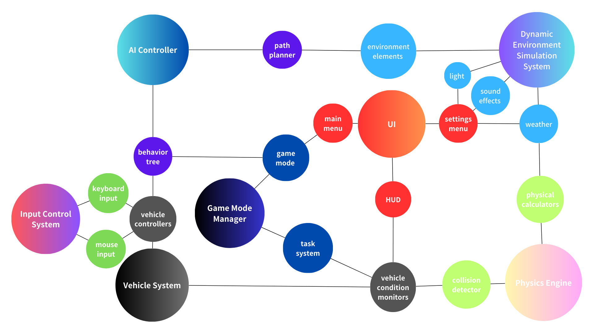

## Architectural Design

We have divided the game architecture into seven modules. In this report, we will explore in depth the functions and interactions of the components presented in each module to provide players with a clear understanding of the structure.

### 1. Game Manager

* **Game Mode**: Manages different game modes (single-player and PVE), receives user input to switch modes, and collaborates with the task system to initiate specific objectives.
* **Task System**: Tracks tasks that players need to complete in single-player mode and provides progress updates to the user interface.

### 2. Input Control System

* **Keyboard Input**: Handles keyboard input and converts it into game commands, then passes the commands to the vehicle system to execute corresponding actions.
* **Controller Input**: Processes input from game controllers to provide a control method and forwards commands to the vehicle system.

### 3. Vehicle System

* **Vehicle Controller**: Controls the vehicle's movement based on input commands, receives commands, and calculates actual movement using the physics engine.
* **Vehicle Status Monitor**: Monitors the vehicle's status and provides status updates to the game manager and user interface.

### 4. Physics Engine

* **Collision Detector**: Detects collisions between vehicles and other objects, and collaborates with the vehicle system to calculate the physical reactions after collisions.
* **Physics Calculator**: Performs physical calculations to update the position and rotation of vehicles, feeding the results back to the vehicle system.

### 5. AI Controller

* **Behavior Tree Manager**: Designs the decision-making logic for AI opponents and dynamically adjusts AI behavior based on environmental information.
* **Path Planner**: Calculates the movement path for AI opponents, integrating GIS data with environmental information to select the optimal route.

### 6. Dynamic Environment Simulation System

* **Weather Controller**: Simulates different weather conditions, providing weather change information to the physics engine to influence vehicle performance.
* **Lighting Management System**: Manages changes in lighting to support the day-night cycle, ensuring the accuracy of environmental lighting and updating the user interface.
* **Sound Effects Manager**: Manages environmental sound effects and updates them in real-time based on scene changes to enhance immersion.
* **Environment Elements**: Generates and manages basic visual objects in the game environment, interacting with the physics engine and weather controller to maintain visual and physical consistency.

### 7. User Interface

* **HUD (Heads-Up Display)**: Displays real-time player information and receives data updates from both the vehicle system and game manager.
* **Settings Menu**: Manages the game menu and collaborates with the game manager to handle player action requests.
* **Main Menu**: Provides the initial interface for players to start the game and access settings, receiving user input to navigate through the game flow.

## UI Design

### Main Components of UI

**Main Menu:** Player can start playing, choose cars and enter Setting Menu by clicking buttons.

**Settings Menu:** Player can customize their own game settings here.

**In-game HUD:** Screen layout while playing, including Mission Briefing, Mini Map and Vehicle Statistics.

### UI Design templte (Using wireframe tool 墨刀):

## PVE Design

### The architecture of PVE can be divided into three core modules:

**Path Generation Module**

**Vehicle Control Module**

**Path Extraction and Steering Instruction Module**

#### 1. Path Generation Module

This module is responsible for creating a path object (`PathActor`) within Unreal Engine and adding a Spline component to define the trajectory. The spline curve serves as the ideal path for vehicle navigation, enabling smooth movement and providing tangent information along the path.

- Create the path object;
- Add the spline curve;
- Provide the `GetPath` interface for other modules to access path information.

#### 2. Vehicle Control Module

This module controls the behavior of the vehicle and interacts with both the path and navigation modules. Its main purpose is to reference the `PathActor` and call the `GetPath` interface to obtain the nearest point and direction information on the spline based on the current vehicle location.

- Receive reference to the path object;
- Call `GetPath` to retrieve navigation info;
- Update the vehicle’s position and direction accordingly.

#### 3. Path Extraction and Steering Instruction Module

This module handles the core logic for path following.

- Finding the nearest location on the path to the vehicle’s current position;
- Extracting the tangent direction at that location;
- Normalizing the direction vector;
- Computing the angle difference (steering) between the current orientation and desired direction;
- Outputting the steering value for vehicle control.

### Justification for PVE Design

- **Clear Module Separation**: `PathActor` handles path creation, `GetPath` performs direction logic, and the vehicle blueprint is responsible for execution. This separation improves maintainability and scalability.
- **High Reusability**: A single `PathActor` can serve multiple vehicles, enabling multi-agent simulations.
- **Data-Driven Design**: `GetPath` only requires position and path inputs, making it easy to test and debug.
