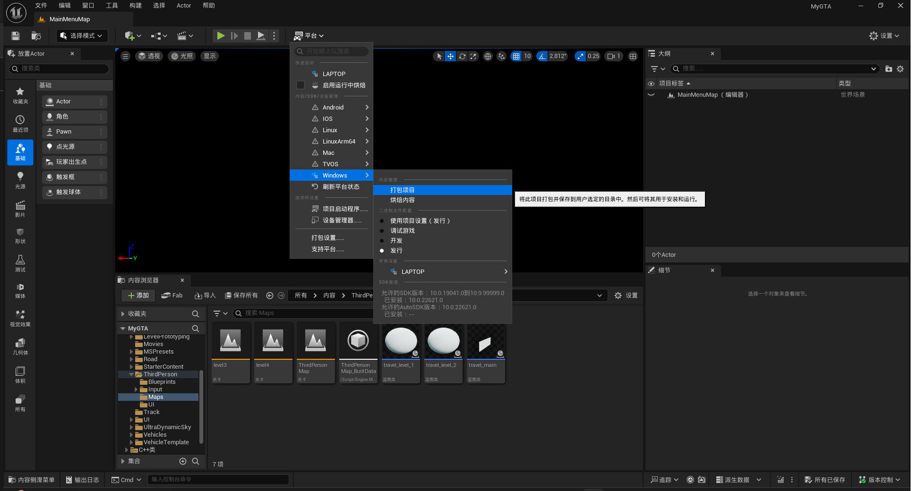
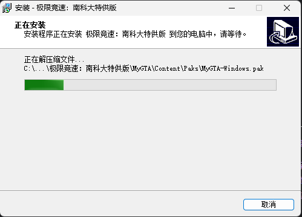

# 极限竞速：南科大 Team 23 Final Report

## 一、 Metrics

本项目使用Unreal Engine 5.5，基于蓝图制作

### UI

- 15个蓝图类
- 平均圈复杂度：5
- 依赖：Electra Player Plugin、Async Loading Screen Plugin、FidelityFX$^{TM}$ Super Resolution 3 SDK

### 车辆控制

- 13个蓝图类

### 环境

* 4个蓝图类
* 平均圈复杂度：3
* 依赖： EuropeanHornbeam、UltraDynamicSky

### AI

* 1个蓝图类

## 二、 Documentation

### Doc for Users

#### 1. 安装游戏

下载[极限竞速：南科大特供版-安装程序](https://pan.baidu.com/s/1cCFS3g0ZGIEVK1AtBxuvuA?pwd=y520)，选择安装路径，点击安装游戏。

#### 2. 开始游戏

进入游戏开场动画后按任意键进入主菜单。

点击“Play”进入主世界，此时是开放世界探索模式。在探索中你会遇到路中间的任务标识，可以按E开启特定任务，例如进入特定关卡的人机对战模式。

#### 3. 暂停游戏

在游戏中按Q键暂停游戏并呼出菜单。你可以点击“Continue”继续游戏，点击“Settings”进入设置界面，或者点击“Quit"离开游戏。

#### 4. 画面设置

在设置界面点击“Graphic”可进入画面设置界面。

在这里你可以开启AMD FSR3。开启FSR3后，超分质量默认为“超级性能”档，帧生成默认开。

你还可以开启抗锯齿。抗锯齿方法默认为TAA。

#### 5. 车辆控制绑定摁键

`Q`：暂停游戏

`H`：显示/隐藏新手指南。

`B`：立即重置车辆。尤其适用于车辆卡住的情况。

`空格键`：通过改变车轮的摩擦系数来启用漂移。

`L`：关闭/近光/远光

`w,a,s,d`：当然，这些是用来加速和转向的。

#### 6. 游戏关卡

在特定位置按`E`进入关卡。

关卡一位于离出生点较劲地点，为竞速挑战。在指定时间内到达终点即可赢得比赛。

关卡二较远，为pve跑圈挑战。在ai之前跑完两圈指定赛道，即可赢得比赛。

### Doc for Developers

#### 1. UI控件

UI控件蓝图、主菜单关卡蓝图和UI相关图标、小地图材质等资产存储在./Content/UI/目录。

- **MainMenoMap:** 这是游戏开始菜单的关卡蓝图，和主菜单有关的UI控件在此处实现。
- **WBP_Menu:** 这是游戏开始菜单的控件蓝图，其中定义了主菜单的样式和按钮功能。
- **WBP_Pause:** 这是游戏暂停界面的控件蓝图，其中定义了暂停界面的样式和按钮功能。
- **WBP_SettingsMain:** 这是游戏设置主界面的控件蓝图，其中定义了一级设置界面的样式和按钮功能
- **WBP_GraphicSettings:** 这是游戏画面设置界面的控件蓝图，其中定义了二级设置界面的样式和按钮功能，其他二级界面同上。
- **BP_GameInstance，BP_SaveSettings和BPI_SaveSettings:** 这是游戏设置参数的实例，用于使用户的设置参数持久化。
- **WBP_MiniMap:** 这是小地图的控件蓝图，用于在HUD界面显示小地图。

#### 2. 车辆控制

基本蓝图：VehicleAdvPawn

* **Event Begin**：事件开始时的控制流

1. 投射车辆移动组件，以便访问专用输入功能
2. 信息HUD初始化：事件开始时初始化信息HUD，这是一个UI界面，用于指示玩家启用的按键及其功能。

* **Event Tick**：每个Tick的控制流，开发者可以实现周期性功能。现在有：

1. 抑制车辆在空中旋转。
2. 重新调整摄像机使其面向前方
3. 漂移时显示漂移效果

   - 漂移标志
   - 车轮上燃烧（包括音效）
4. 使用FOV动态缩小摄像机距离：

   - 如果您需要其他缩小距离，请修改“地图范围限制”

* **Steering and Throttle Controls**：这是转向和油门控制的基本控制流。如果您想修改转向或油门控制行为，或者添加一些新功能，这里就是您要找的地方。
* **Braking controls**：这是刹车控制的基本控制流程。如果您想修改刹车行为或添加一些新功能，这里就是您要找的地方。现在音频组件已绑定到刹车上。
* **Camera Controls**：摄像头会随着时间的推移重新调整为面向前方。
* **Switches between back and front camera**：目前通过触发器切换。您可以使用任何您想要的分支。
* **使用 FOV 动态缩小摄像头距离**：通过Event Tick 检查

#### 3. 环境

* **Building**： 内含所有建筑物的纹理、材质和网格体，可以根据需要进行替换与修改。
* **Road**： 内含所有的道路和路灯的纹理、材质、网格体与Actor，可以根据需要进行替换与修改。
* **EuropeanHornbeam**： 内含所有的树木的纹理、材质、网格体和植物体，可以根据需要进行替换与修改。
* **Ultra_Dynamic_Sky and Ultra_Dynamic_Weather**： 分布用于控制天空和天气，支持丰富多样的自定义类型。

#### 4. AI

AI车辆蓝图类：SportsCar_Pawn_ai2

样条对象：Auto1_Spline

AI车辆作为子类继承第2节中的车辆控制设置

* FindNearestSpline函数
  1. 输入：样条对象
  2. 输出：样条对象
  3. 功能：寻找最近的样条
* CalculateSteeringInput函数
  1. 输入：样条对象
  2. 输出：浮点数
  3. 功能：决策当前状态如何转向
* CalculateBrakeInput函数
  1. 输入：样条对象、当前与规划路线之间的切线向量
  2. 输出：浮点数
  3. 功能：决策当前状态如何刹车
* 主函数
  持续更新自己的位置，通过自身和赛道的相对位置规划路线，并根据当前位置、速度、相对位置以及规划的路线调用不同的控制器，如油门，刹车，转向等。

## 三、 Tests

在本项目中，我们采用了功能测试编辑器（Functional Testing Editor）来确保游戏各个模块按照预期正常工作。具体测试措施包括：

* **功能模块测试**：我们通过功能测试编辑器对游戏中的关键功能进行验证，如车辆控制、任务系统、AI 行为等，确保它们能正常响应用户输入并执行预定操作。
* **测试覆盖率**：使用测试覆盖率工具生成的报告显示，测试覆盖了关键路径的 90% 以上，确保了代码的质量和稳定性。
* **手动测试**：除了自动化测试外，团队还进行了多轮手动测试，专注于用户界面的可用性和游戏流程的顺畅性，收集玩家反馈后进行相应调整。

## 四、Build

构建过程使用了 Unreal Engine 5 (UE5) 内置的打包功能，生成可在 Windows 上运行的可执行文件（.exe）。具体步骤如下：

* 打包设置：在 UE5 中进行项目设置，配置需要打包的场景和资源，确保所有必要内容被包括在内。
* 生成可执行文件：通过 UE5 的打包功能，一键生成游戏的可执行文件，确保游戏能够在目标操作系统上正常运行。

## 五、Deployment

* 部署方法：使用 Inno Setup 创建的安装包，用户只需运行安装程序，按照提示完成安装即可。
* 安装包内容：安装包中包括游戏的可执行文件、所需的动态链接库（DLL），以及配置文件和资源文件，确保用户在安装后可以顺利运行游戏。
